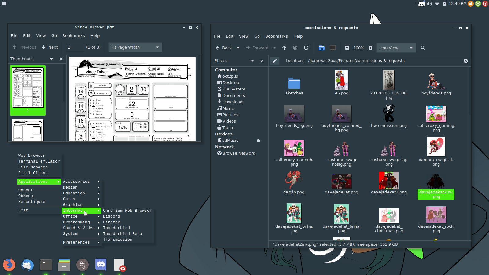

# Numix-Jade

Modification of Numix Theme taken from Debian Stretch Repo. Intended for personal use but posted here as a reference to my r/unixporn post.

## Screenshots

### Note
Intended for use with Openbox, has not been tested with any other WMs, expect random discolorations, modifications are primarily to the gtk3.20 dark theme, with some modifications to the light theme for the sake of Firefox. Zero modification to gtk2 themes as the number of gtk2 applications rapidly approaches zero.
